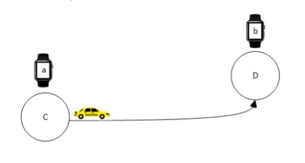
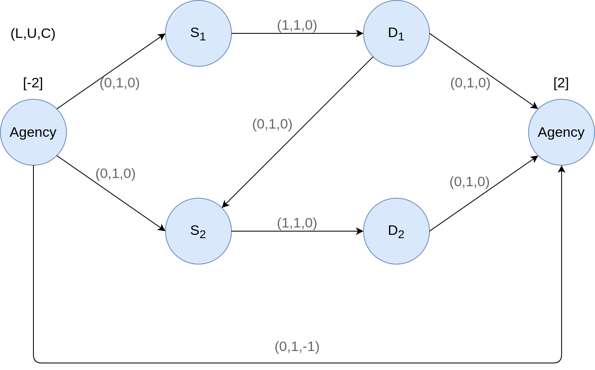
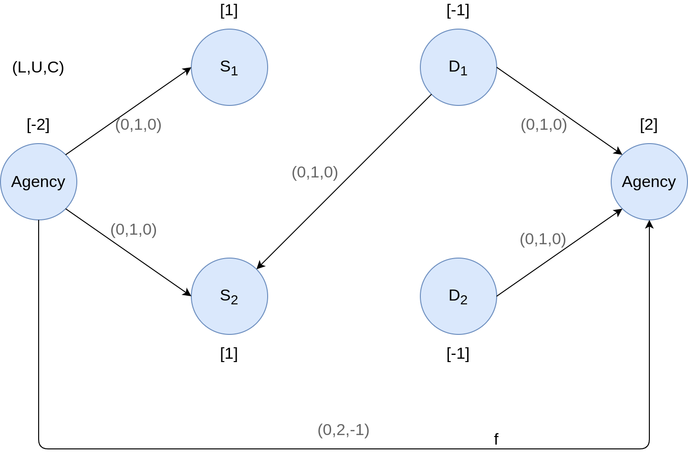
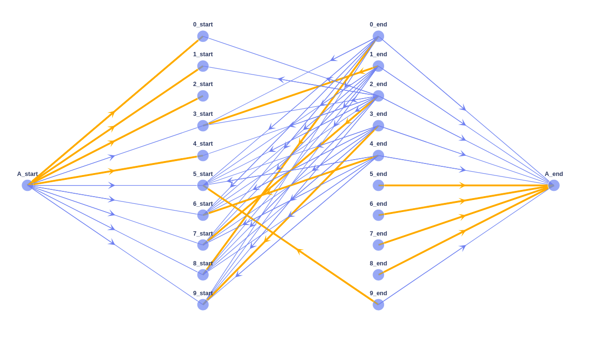
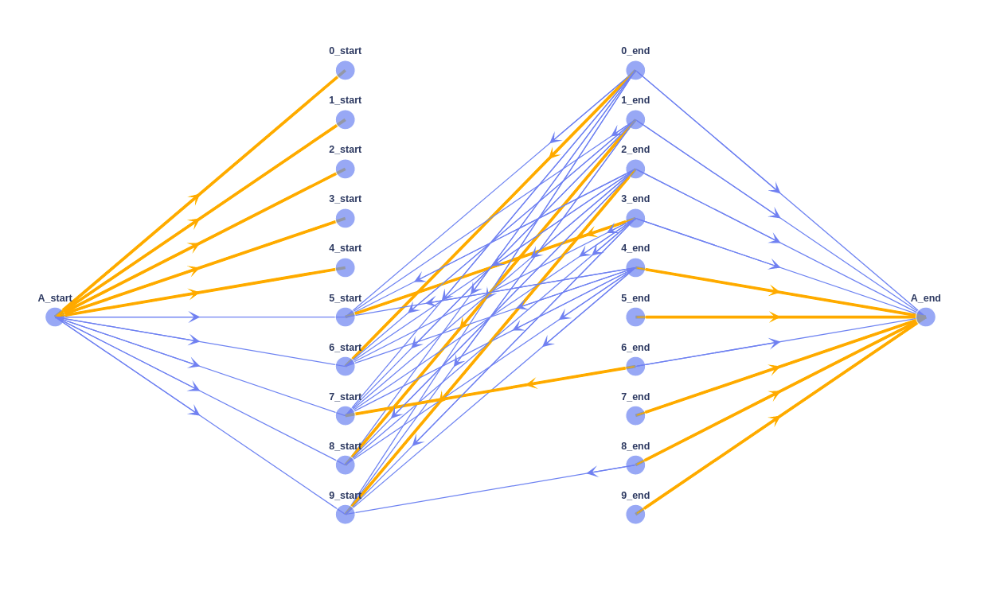
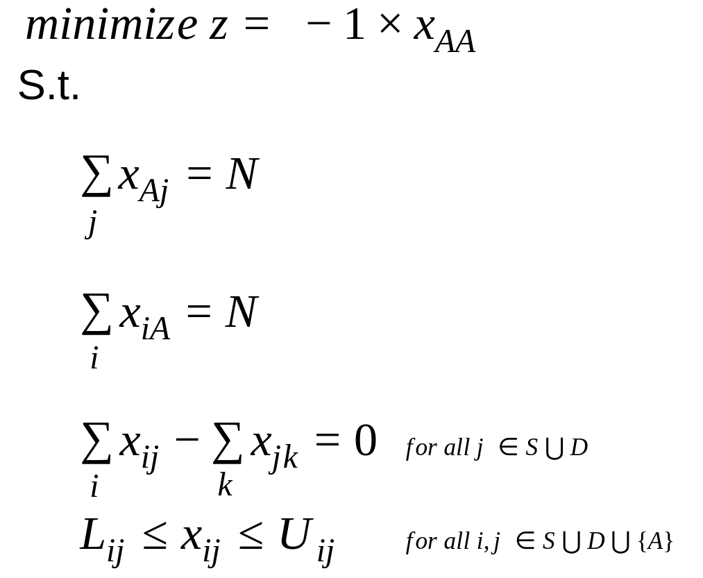
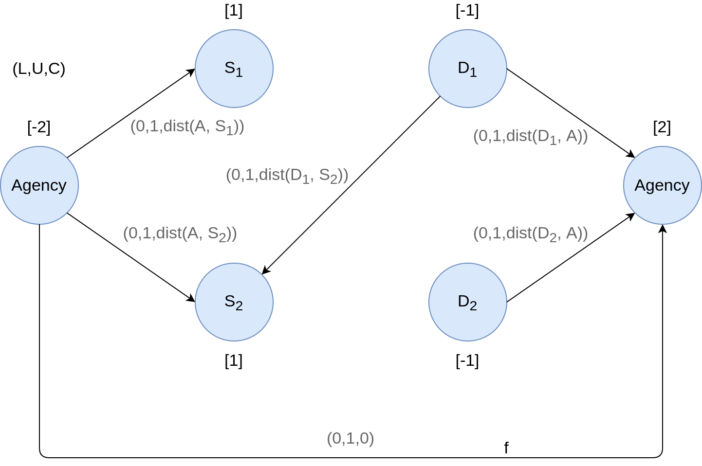
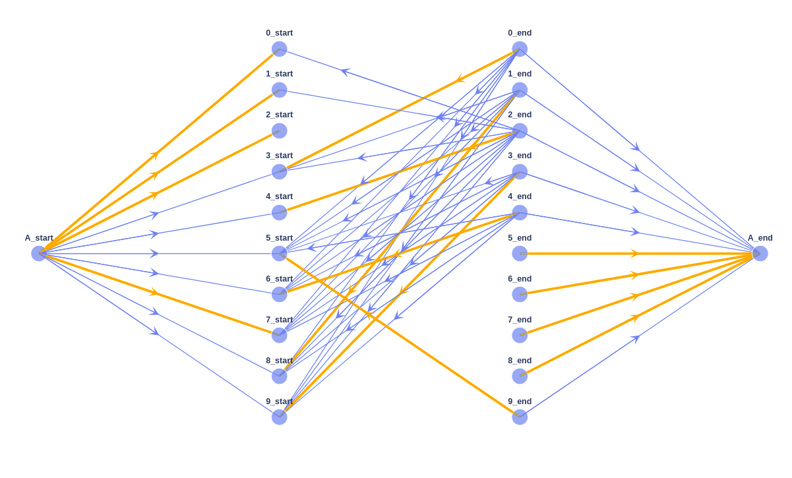
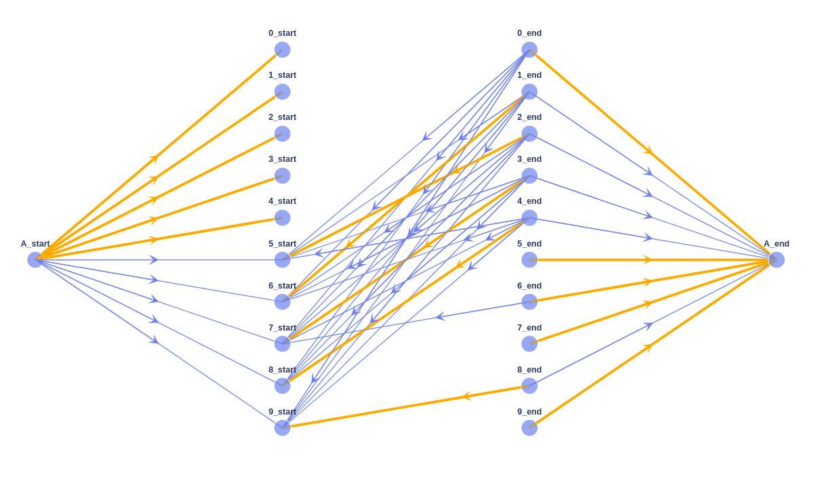
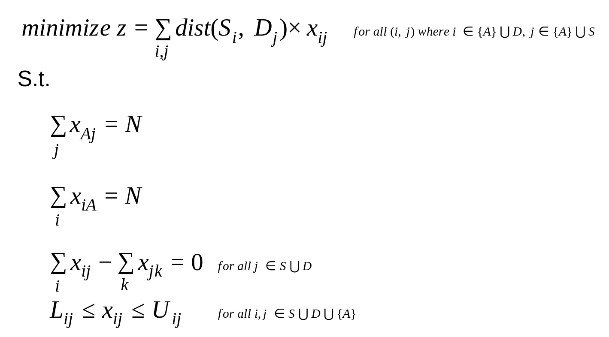

= Taxi Transportation Optimization Problem 

In this project, we asked to optimize the following aspects of scheduling a workday for a hypothetical taxi agency

* Phase 1: Minimizing the number of taxi drivers 
* Phase 2: Minimizing the amount of time in which the taxi has no passenger in order to minimize the environmental cost

* Phase 3: To find an optimal point according to the trade-off between minimizing the number of cars and environmental cost

This project contains several datasets, and each dataset consist of _N_ trips which are denoted by _a~i~_, _b~i~_, _s~i~_, _d~i~_:

- _a~i~_: the start time of trip _i_
- _b~i~_: the end time of trip _i_
- _s~i~_: the starting point of the trip _i_
- _d~i~_: the ending point of the trip _i_

In the project, the class `_Trip_` is defined to model trips in our implementation.

There is also a _MatrixD_ which shows the distances between every point in our problem, e.g. element _d~zy~_ indicates the distance between location _z_ and location _y_. There is a dictionary in our implementation called `_dist_` that represents this matrix. 

Note that the taxi agency is located at location _1_.

After each trip, the taxi driver can go back to the agency or go for another trip. After finishing a trip we can decide whether the driver come back to the agency with no passenger or taking another available trip.

''''

== Phase 1

This minimization can be achieved using either *Minimum Cost Flow* network problem or mathematical modeling (*Integer Programming*).

==== Minimum Cost Flow Problem Model

Assume that the flow in the minimum cost flow problem denotes the number of taxi drivers and each trip is represented by 2 nodes (_s~i~_, _d~i~_). Hence, the problem is modeled in a way that the capacity of edges and the demands of nodes restrict the network flow to solve the problem.

In the figure below, the network model is depicted for only two trips. Obviously the maximum required number of cars is equal to two. The lower and upper bound of the edges (_S~1~_, _D~1~_) and (_S~2~_, _D~2~_) force the model to assign exactly one taxi to each trips.

The cost of bypass arc (_Agency_, _Agency_) is set to be -1 so that the model pass flow through  this arc as much a possible and minimize the flow (number of cars) in the main network. The _upper bound_ of bypass arc is equal to _N_. If the flow fills the bypass arc completely, it means there is no car assigned to any trip.

The edge (_D~1~_, _S~2~_) shows if a taxi can start _trip 2_ after _trip 1_ was finished.

Considering the fact that the `Netwokx` library does not supprot _lower bound_ constraints on edges, we had to do a technique and simulate these constraints by the corresponding demand capabilities of nodes. The technique is to set -1 as demands on _S~i~_ and 1 on _D~i~_ respectively as depicted in the following figure.

After solving this model using `networkx.network_simplex`, the minmium number of cars is equal to `_N-f_` where _f_ is the flow of bypass arc.

The following figure is the solved network for `General-Dataset-1.txt`. The orange arcs show the passed flows (taxies). Note that the bypass arc is not plotted in order to simplify the model. The optimal car assignment for this problem is:

- taxi 1: _trip 0 - trip 8_
- taxi 2: _trip 1 - trip 3 - trip 9 - trip 5_
- taxi 3: _trip 2 - trip 7_
- taxi 4: _trip 4 - trip 6_

The minimum number of required taxies is equal to 4.

The solved model for dataset `d1.txt`:

- taxi 1: _trip 0 - trip 6 - trip 7_
- taxi 2: _trip 1 - trip 8_
- taxi 3: _trip 2 - trip 9_
- taxi 4: _trip 3 - trip 5_
- taxi 5: _trip 4_

The minimum number of required taxies is equal to 5.

==== Integer Programming Model

The Integer Programming model is basicaly our network model which is formulated mathematically to be solved by an integer programming solver (in this case `pulp` library). The formulation is as follows:

.Benchmarks
[cols="^1,^1,^1"] 
|===
|Dataset |Network Simplex RunTime (sec) |ILP RunTime (sec)

|`General-Dataset-1`
|123
|321

|`General-Dataset-2`
|123
|321

|`General-Dataset-3`
|123
|321

|`d1`
|321
|321

|`d2`
|123
|321

|`d3`
|321
|321
|===

.Results
[cols="^1,^1,^1"] 
|===
|Dataset |Network Simplex Optimal Solution |ILP Optimal Solution

|`General-Dataset-1`
|123
|321

|`General-Dataset-2`
|123
|321

|`General-Dataset-3`
|123
|321

|`d1`
|321
|321

|`d2`
|123
|321

|`d3`
|321
|321
|===

''''

== Phase 2

Like the 1^st^ phase, this minimization can also be achieved using either *Minimum Cost Flow* network problem or mathematical modeling (*Integer Programming*).

==== Minimum Cost Flow Problem Model

In this phase, the objective is to minimize the time in which the taxies are traveling without any passenger. The arcs that indicate this situation are:

- (_Aency_, _S~i~_) : The taxi leaving the _agency_ to pick up a passenger
- (_D~i~_, _Agency_): The taxi returning to the _agency_ with no passenger
- (_D~i~_, _S~j~_): The i^th^ trip is finished and the taxi is going for j^th^ trip 

Each arc has its own cost which is calculated according to the distance between its source and destination.

The following figure indicates the model for two trips. In this phase, there is no concern about minimizing the number of required cars, so the cost of bypass arc is set to be zero. 

The following figure is the solved network for `General-Dataset-1.txt`. The optimal car assignment for this problem is:

- taxi 1: _trip 0 - trip 3 - trip 9 - trip 5_
    * cost = 18 + 0 + 11 + 7 + 11
- taxi 2: _trip 1 - trip 8_
    * cost = 20 + 8 + 20
- taxi 3: _trip 2 - trip 4 - trip 6_
    * cost = 11 + 0 + 12 + 6
- taxi 4: _trip 7_
    * cost = 4 + 18

The number of required taxies: 4
The minimum environmental cost: 146

The solved model for dataset `d1.txt`:

- taxi 1: _trip 0_ 
    * cost: 16 + 0
- taxi 2: _trip 1 - trip 6_ 
    * cost: 20 + 8 + 4
- taxi 3: _trip 2 - trip 5_ 
    * cost: 19 + 0 + 19
- taxi 4: _trip 3 - trip 7_ 
    * cost: 20 + 8 + 20
- taxi 5: _trip 4 - trip 8 - trip 9_ 
    * cost: 16 + 4 + 0 + 0

The number of required taxies: 5
The minimum environmental cost: 154

==== Integer Programming Model

Same as pahse 1, the Integer Programming model our network model which is formulated mathematically to be solved by `pulp`. The formulation is as follows:

